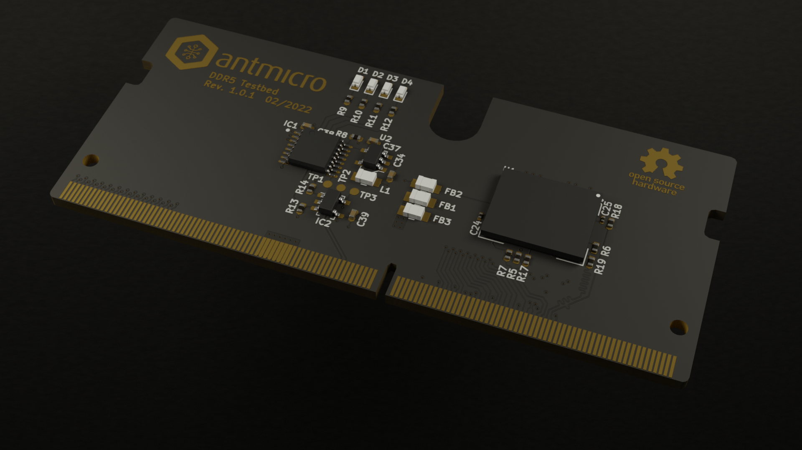

============
DDR5 testbed
============

Copyright (c) 2022 `Antmicro <https://www.antmicro.com>`_

Overview
--------

This repository contains open hardware design files for an experimental test module in the form of SO-DIMM.
The module includes a single DDR5 RAM IC with all signals break-routed in the SO-DIMM edge connector.
The board has been designed to target Micron `MT60B2G8HB-48B:A <https://media-www.micron.com/-/media/client/global/documents/products/data-sheet/dram/ddr5/16gb_ddr5_sdram_diereva.pdf?rev=c95e4a49184145f18e105cc41e0ee643>`_ 16Gb DRAM.
The design files were prepared in KiCad.
Please note that this board is not electrically compatible with off-the-shelf SO-DIMM DDR memory modules.
It is compatible with `this <https://github.com/antmicro/lpddr4-test-board>`_ experimental platform.

Repository structure
--------------------
The main repository directory contains KiCad PCB project files, a LICENSE and README.
The remaining files are stored in the following directories:

* ``lib`` - contains the component libraries
* ``img`` - contains graphics for this README

License
=======

`Apache-2.0 <LICENSE>`_
